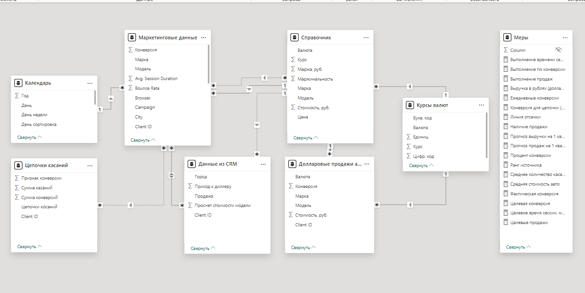
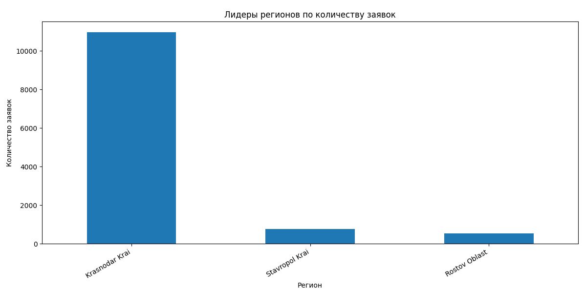
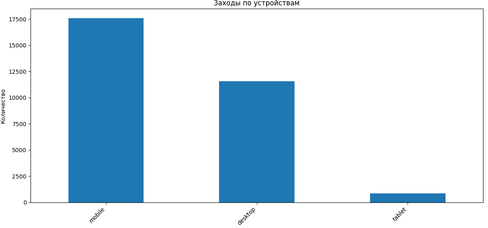

# Промежуточная аттестация. Часть 1
## Описание бизнес кейса
Авто дилер Премиум Авто хочет проанализировать эффективность маркетинговых кампаний в интернете. Так как у самой компании не хватает компетенций для такого анализа, то она наняла консалтинговую IT компанию, которая должна помочь ему в этом проекте. В ходе пресейла консультанты договорились с клиентом, что сделают пилотный проект на основании ограниченных данных за 1,5 месяца и по двум маркам: BMW и Mercedes. Если результаты пилотного проекта устроят заказчика, то будет заключен полноценный контракт на внедрение проекта, который будет позволять отслеживать эффективность маркетинга на постоянно основе.
В рамках пилотного проекта, мы решили объединить данные из Google analytics и CRM системы, для того, чтобы посмотреть какие кампании приводят не только к заявкам, но и к продажам. Наши коллеги внедрили Client ID, который пробрасывается из web аналитики в CRM, данные были накоплены за несколько месяцев и параллельно были созданы коннекторы к Google analytics и CRM. Текущая наша задача заключается в том, чтобы забрать данные из систем, объединить их, вывести недостающие данные и на их основе выдать клиенту дашборд, который ответить на его вопросы.

Описание датасета и инструментария:

Данные из 2 систем
2 рабочие таблицы
1 справочник
1 источник внешний из интернета
Проект можно выполнить по-разному, поэтому вы можете сами выбирать инструмент, в котором выполняете задание: Excel, Power BI или Python. Однако вы должны использовать все три инструмента на разных этапах работы.

## 1. Работа с данными (Подготовка данных)

- Ссылка на данные: https://docs.google.com/spreadsheets/d/152JyksagijqyscnrFDc6Ez2VjT5MKNXpDOyc4PRlauw/edit#gid=208646510
- Выделите в Маркетинговых данных признак марки и модели автомобиля
- Загрузите данные по курсам валют на дату с сайта ЦБ РФ
- Объедините все 4 получившиеся таблицы
- Добавьте недостающие показатели в Справочник: Итоговую стоимость в рублях и маржу в рублях
- Добавьте недостающие данные: цепочки касаний, сумма конверсий по цепочкам, признак конверсии по цепочкам, сумма касаний для каждой цепочки и соответственно каждого пользователя.


Данная часть задания выполнена с использованием Excel и MS Power BI.



### 2. Аналитика


Данная часть задания выполнена с использованием Excel , Python и MS Power BI ().

Рассчитайте следующие показатели:
1. Из каких регионов больше всего заявок?
Лидеры регионов с наибольшим количеством заявок:

2. Какой средний процент отказов (Bounce)?
```Actionscript
Средний процент отказов: 0.30167672255741856%
```
3. С каких устройств чаще заходят на сайты?


4. Какие источники наиболее конвертируемые?
Лидеры источников по количеству конверсий:


Рассчитайте ROMI (при расчете придумайте методологию расчета средней стоимость проданного автомобиля)
```Actionscript
Расчет дохода на основе средней стоимости автомобиля= 5333674
Предположим, что стоимость привлечения одной сессии составляет 50 руб.

Топ-10 источников по ROMI:
                                   Sessions GoaCompletions     Revenue  Conversion Rate  Marketing Cost        ROMI
Source
zoon.ru                         1.0               1.0   5333674.0              1.0            50.0  10667248.0
krd.yuginform.ru                1.0               1.0   5333674.0              1.0            50.0  10667248.0
bitrix.aviline.local            1.0               1.0   5333674.0              1.0            50.0  10667248.0
baidu.com                       1.0               1.0   5333674.0              1.0            50.0  10667248.0
avtoavto.ru                     1.0               1.0   5333674.0              1.0            50.0  10667248.0
kometa-search.ru                1.0               1.0   5333674.0              1.0            50.0  10667248.0
alohafind.com                   1.0               1.0   5333674.0              1.0            50.0  10667248.0
krd.rusdealers.ru               2.0               2.0  10667348.0              1.0           100.0  10667248.0
krasnodar.drom.ru               4.0               4.0  21334696.0              1.0           200.0  10667248.0
crm2company.streamwood.ru       1.0               1.0   5333674.0              1.0            50.0  10667248.0
```
5. Посчитайте выручку в рублях только по долларовым позициям
```Actionscript
Данная часть задания выполнена с использованием Power BI: 7.01 млрд руб.
```
6. Определите, какой источник трафика наиболее выгоден для компании по текущим данным?
```Actionscript
Это задание выполнено в  Power BI.
Наиболее выгодный источник трафика - `google`
22 432 Sessions
9 106 Конверсий
241 050 838 Goal Value
```
7. Ответьте на вопрос: каких показателей не хватает, чтобы посчитать чистую прибыль?
```Actionscript
Operating Expenses — расходы на ведение бизнеса, которые включают:
Аренду помещений
Затраты на маркетинг и рекламу
Cost of Goods Sold, COGS — расходы на производство или закупку товаров, которые продаются клиентам (включая материалы, транспортные затраты, хранение и т.д.).
Коммунальные платежи, страховки и прочие административные расходы
Налоги — налоговые обязательства компании, включая налоги на прибыль, НДС и прочие сборы.
Прочие расходы и доходы — такие как проценты по кредитам, амортизация, штрафы или другие непредвиденные расходы.
```
8. Сделать прогноз до конца февраля по количеству конверсий на каждый день
```Actionscript
Это задание выполнено с использованием графика  Power BI.
"Прогноз до конца февраля  по количеству конверсий каждый день" (18-29 февраля) и расчеты new_code.py
``` 
9. Какая будет выручка за первый квартал, если средняя стоимость авто останется неизменной, а продажи будут пропорциональны текущим данным?
```Actionscript
Данная часть задания выполнена с использованием меры в MS Power BI.
334.02 млрд руб. прогноз выручки на 1 квартал
``` 
Задание выполнено в Python [new.code](new_code.py)
Задание выполнено в Power BI Промежуточная аттестация (часть 1)

## 3. Визуализация


Эти задания выполнены с использованием  Power BI - Дашборд.

Настройте цветовую тему и оформите дашборд, который содержит следующую информацию:
- Цепочки касаний с дополнительными полезными характеристиками и с раскраской в зависимости от того, была ли продажа у цепочки
- Карту продаж по регионам и городам
- Матрицу с воронкой продаж по каждой модели и марке
- Количество продаж по источникам трафика с линией отсечки в 230
- Декомпозицию продаж по источникам трафика (Source, Medium, Keyword, Campaign)
- Продажи за каждый день с раскраской по выполнению целевых показателей (их выберете сами)
- Фильтр по количеству касаний и признаку конверсии + любые другие полезные фильтры, которые посчитаете нужным (от 5 до 7 фильтров всего)
- Среднее количество касаний в цепочке

Задание выполнено в Power BI Промежуточная аттестация (часть 1)