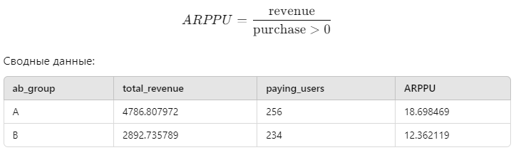
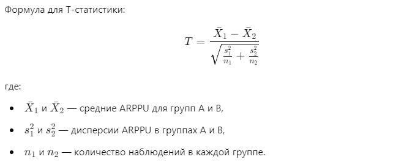
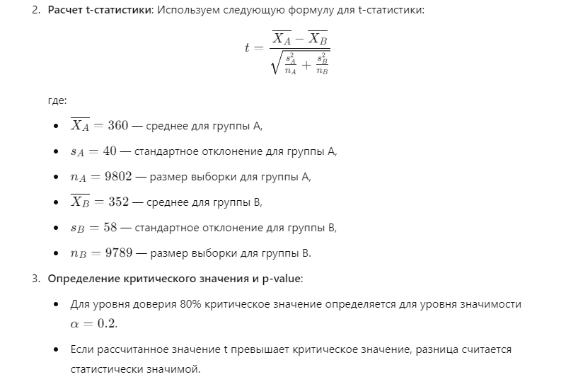
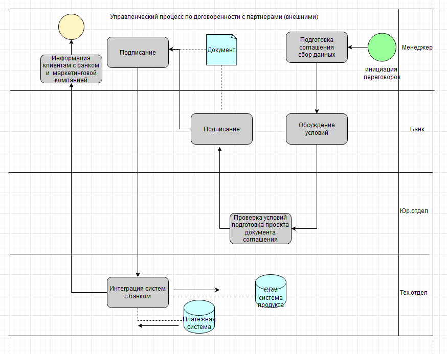
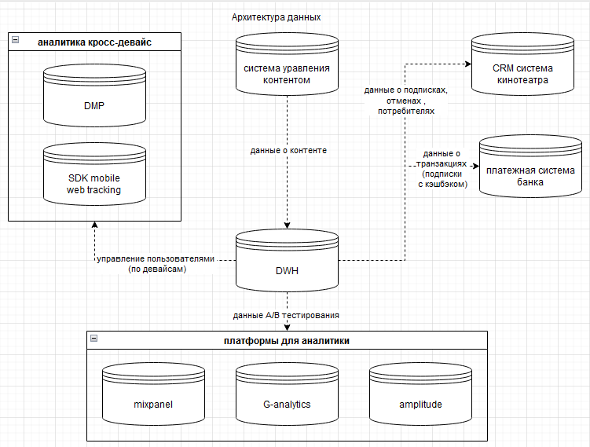
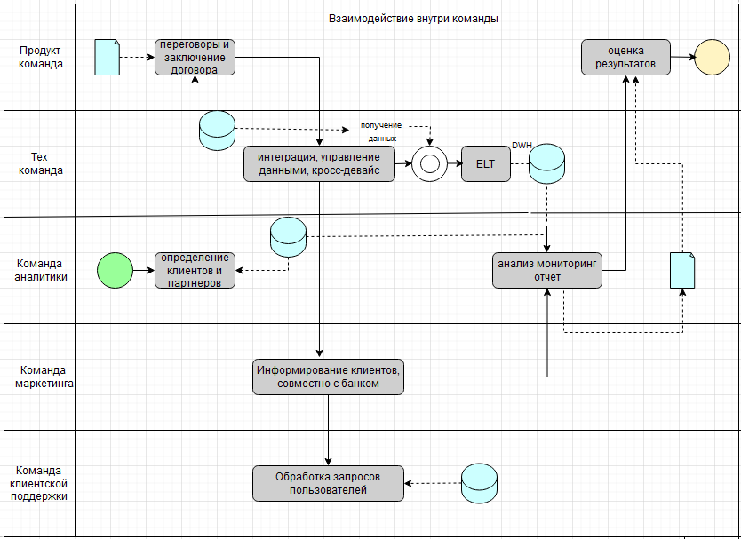

# Итоговая аттестация. Часть 2.


## Здание 1. 

Подведите итоги эксперимента в экселе по следующим данным:
[ab_stats.csv]


Стат значимо ли отличается ARPPU в двух группах?
Какие рекомендации дадите менеджеру?


Файл содержит данные с колонками:

- revenue: выручка, полученная от пользователя.
- num_purchases: количество покупок, совершенных пользователем.
- purchase: факт покупки (0 или 1).
- ab_group: группа A/B-теста (A или B).
- av_site visit: среднее время на сайте (вероятно, среднее время посещения).

ARPPU (Average Revenue Per Paying User) для каждой группы рассчитывается как:




Теперь необходимо провести статистический тест (например, t-тест) для проверки значимых различий между группами. Для вычисления T-статистики и P-значения используем t-тест для двух независимых выборок:

- Формулировка гипотез:
1. Нулевая гипотеза (H₀): Средние значения ARPPU в группах A и B одинаковы.
2. Альтернативная гипотеза (H₁): Средние значения ARPPU в группах A и B различаются.


Для проверки гипотез применим t-тест для двух независимых выборок, чтобы рассчитать T-статистику и p-значение.

**T-тест:**
Основные параметры для t-теста:



### P-значение:

После расчета t-статистики используем распределение Стьюдента (t-distribution), чтобы получить p-значение, которое указывает на вероятность того, что различие между группами является случайным.

Вычисления в нашем случае:

1. *Средние значения* для групп A и B: это были фактические ARPPU.
2. *T-статистика*: 1.13
3. *P-значение*: 0.26

T-статистика 1.13 указывает на небольшую разницу между группами, но p-значение 0.26 (больше 0.05) означает, что эта разница статистически незначима.

Таким образом, можно сказать, что различие ARPPU между группами A и B могло возникнуть случайно, и оно не является доказанным на уровне значимости 5%.

**Рекомендации менеджеру**:
На основе текущих данных и анализа можно сделать вывод, что изменение (тестирование группы B) не привело к значимому изменению выручки на пользователя. 
Рекомендуется проанализировать другие метрики или провести более длительное тестирование для получения более точных результатов.

Расчет сделан в xlsx [Задание 1.](<c:/work/prom_part2/Задание 1.xlsx>)   
Расчет сделан в python [topic1](c:/work/prom_part2/topic1.py) 
 
## Задание 2.

Мы хотим провести А/Б-тест для трех источников трафика. Нынешняя конверсия равна 5%, мы ожидаем прирост в 0,2%. Уровень доверия 97% и уровень мощности 87%.
Всего на наш продукт заходит 40 000 пользователей в месяц.

За сколько дней мы сможем протестировать гипотезу? И что вы можете посоветовать по результатам подсчета?

**Решение:**

Параметры задания::

- Конверсия текущая: 5\% (или 0.05).
- Ожидаемый прирост: 0.2\% (или 0.002).
- Уровень доверия: 97\% — это означает, что   1 - 0.97 = 0.03.
- Мощность теста: 87\% — это значит, что  = 1 - 0.87 = 0.13.
- Количество пользователей в месяц: 40,000.

Используем статистические методы для расчета необходимого размера выборки для A/B-теста, а затем определим, сколько дней потребуется для достижения этого объема выборки с данным потоком трафика.

Расчет сделан в python [Topic2](c:/work/prom_part2/topic2.py)

Расчет показывает следующие результаты:

```markdown
Необходимый размер выборки для каждой группы: 259748 пользователей
Общее количество пользователей для теста: 779244
Необходимое количество дней для тестирования: 584.43 дней
```
Конверсия для каждого источника: вычисляется процентная конверсия для каждого источника и выводится в виде процентного значения.  
Z-тест для сравнения пропорций: функция calculate_z_p используется для расчета Z-статистики и p-value между двумя группами, учитывая объединенную пропорцию и стандартную ошибку.

1. Длительность теста:  
     Общее количество пользователей, необходимых для тестирования, составляет около 525,893.  
    При текущем трафике в 40,000 пользователей в месяц тест будет длиться примерно 394 дня, что более чем год.

2. Малый прирост конверсии:
    Ожидаемый прирост конверсии составляет всего 0.2%. Это очень незначительное изменение, что требует большого объема данных для того, чтобы надежно подтвердить статистическую значимость результатов.

3. Высокий уровень доверия и мощности:
    Мы задали довольно высокие параметры для уровня доверия (97%) и мощности теста (87%). Это обеспечивает точные и надежные результаты, но требует значительно большего объема данных.

 Рекомендации:

1. Скорость набора данных: При таком размере выборки понадобится около 
≈ 6.52 месяцев.
2. Оптимизация трафика: Использовать более узкие сегменты пользователей или оптимизировать целевой трафик.

4. **Другие показатели**:
- Помимо конверсии, рассмотреть возможность тестирования других метрик, которые могут дать более быстрые и значимые результаты.
Например, измерение средней выручки на пользователя (ARPU), времени на сайте или других факторов, которые могут быстрее показать результаты.
-  Такой длительный тест может быть не очень эффективным, поэтому стоит рассмотреть возможности оптимизации параметров или проведения теста на других метриках.


## Задание  3.

Допустим в задаче нет проблемы с количеством посетителей на сайт, тогда подведите результаты тестирования, если у нас следующие результаты по количеству конверсии:

1 - 25000
2 - 30000
3 - 32000

**Решение:**

Для каждого источника нужно рассчитать фактическую конверсию и провести тест для определения статистически значимых различий.

Рассчитанные конверсии для трёх источников [topic3](c:/work/prom_part2/topic3.py)

-  1: 62.5% (25 000 конверсий).
-  2: 75% (30 000 конверсий).
-  3: 80% (32 000 конверсий).

Эти конверсии значительно выше текущей базовой конверсии в 5%.
Проверим статистическую значимость различий между этими источниками.
Выполним парные статистические тесты [topic3](c:/work/prom_part2/topic3.py)

Результаты статистического анализа:

1. **Сравнение источников 1 и 2**:
    - Z-статистика: -38.14
    - P-значение: < 0.000

2. **Сравнение источников 2 и 3**:
    - Z-статистика: -16.93
    - P-значение: < 0.000


## Задание 4.

Вы решили сравнивать метрику CPA в двух группах. Размер выборки - 2350 элементов в каждой группе.
Для проверки нормальности распределения на выборке в 2350 наблюдений применили, критерий Шапиро-Уилка и получили p-value, равный 0.00002, alpha = 5%.
Какой бы вывод мы могли сделать в данном случае?
В этом случае какой статистический критерий для проверки первоначальной гипотезы тут лучше всего подойдёт и почему?

**Решение:**
При применении критерия Шапиро-Уилка с 𝑝-value=0.00002 и уровнем значимости 𝛼
α=0.05, мы можем сделать следующие выводы:

**Вывод о нормальности распределения**

Поскольку p-value меньше уровня значимости α=0.05, мы отвергаем нулевую гипотезу о том, что данные распределены нормально. Это означает, что в данных присутствуют значительные отклонения от нормальности, и мы не можем полагаться на предположение о нормальности распределения для метрики CPA.

**Выбор статистического критерия**  
Из-за ненормального распределения данных мы должны использовать непараметрический тест для проверки первоначальной гипотезы.  


**Подходящими критериями в данном случае будут:**

1. U-критерий Манна–Уитни (Mann-Whitney U Test), если нам нужно сравнить распределение значений CPA между двумя независимыми группами. Этот тест не предполагает нормальности распределения данных и подходит для случаев, когда нужно сравнивать центральные тенденции двух независимых выборок.

2. Критерий Колмогорова-Смирнова также может подойти для сравнения распределений двух групп, особенно если важно проверить гипотезу о равенстве распределений в целом, а не только их медиан.

Оба теста не требуют нормальности данных, поэтому они лучше подходят для анализа CPA в двух группах с ненормальным распределением данных.
В данном случае, критерий Шапиро-Уилка был применён для проверки нормальности распределения метрики CPA в двух группах.


## Задание 5.

Мы провели АБ-тест на увеличение average timespent per user. По итогам тестирования мы получили следующие данные.
Является ли результат статистически значимым с уровнем доверия 80%? Какую версию мы выкатим на продакшн?

A) Средняя - 360, отклонение - 40, количество - 9802  
B) Средняя - 352, отклонение - 58, количество - 9789

**Решение:**

Чтобы определить, является ли разница в среднем времени, проведённом пользователем, статистически значимой с уровнем доверия 80%, можно применить t-тест для двух выборок с известными средними, стандартными отклонениями и размерами. При этом уровень значимости 𝛼 для доверия 80% составляет 0.2 (или 20%).

**Шаги для анализа**
Формулировка гипотез:
Нулевая гипотеза H0: средние значения времени, проведённого пользователями в группах A и B, не различаются (разница статистически незначима).
Альтернативная гипотеза H1: cредние значения времени, проведённого пользователями в группах A и B, различаются (разница статистически значима).


Расчеты для этого теста выполнены в [topic5](c:/work/prom_part2/topic5.py)

### Вывод:

P-значение показывает, что разница между группами A и B статистически значима на уровне доверия 
Это значит, что среднее время на сайте в группе A  действительно больше, чем в группе B, и эта разница не случайна.


## Задание 6.

Создайте техническую архитектуру проекта по А/B тестированию продукта он-лайн кинотеатра с учетом кросс-девайс аналитики по следующей гипотезе:
Если договориться с банком о 99% кэшбэке на подписку первого месяца, то это повысит конверсию в подписку на 30%, благодаря упрощенному принятию решения со стороны пользователя. На схеме необходимо отобразить:

1) Управленческий процесс по договоренностям с внешними партнерами
2) Архитектуру данных с указанием систем, из которых будем скачивать данные
3) Внутрикомандное взаимодействие

**Решение:**

Создание технической архитектуры для A/B-тестирования гипотезы в онлайн-кинотеатре с кросс-девайс аналитикой включает несколько ключевых блоков: управленческий процесс, архитектуру данных и взаимодействие команд.

### 1. **Управленческий процесс по договоренностям с внешними партнерами**:

- Цель: Договориться с банком о предоставлении 50% кэшбэка на подписку первого месяца.
- Включает взаимодействие с менеджером, юридическим отделом и банком.
- Основные шаги:
 - Переговоры с банком о кэшбэке.
 - Оформление юридического соглашения о кэшбэке.
 - Интеграция с банком (API для отслеживания транзакций кэшбэка).
 - Совместная маркетинговая кампания для информирования клиентов.
 

### 2. **Архитектура данных с указанием систем**:

- Источники данных:
 - CRM системы онлайн-кинотеатра: данные о пользователях, подписках, отменах.
- Банк/Платежная система: данные по транзакциям (подтверждение подписки с кэшбэком).
- Кросс-девайс аналитика:
 - DMP (Data Management Platform): управление пользователями по девайсам.
 - Mobile SDK и Web Tracking: отслеживание действий пользователей на всех устройствах.
  - Система управления контентом: данные о контенте, с которым взаимодействуют пользователи.
 - ETL процесс (Extract, Transform, Load):
 - Из всех систем данные собираются в Data Warehouse (DWH)для анализа.
 - Аналитическая платформа для A/B-тестирования (например, Google Analytics, Mixpanel, Amplitude).



### 3. **Внутрикомандное взаимодействие**:

- Продуктовая команда: Разработка гипотезы, координация A/B-теста, настройка взаимодействия с партнёрами.
- Техническая команда: Настройка интеграций с внешними партнёрами, разработка кросс-девайс аналитики, управление данными.
- Аналитики: Проведение анализа данных, построение A/B-тестов, анализ конверсий, подготовка отчетов.
- Маркетинговая команда: Совместная кампания с банком по продвижению кэшбэка.
- Команда поддержки клиентов: Обработка запросов пользователей по вопросам кэшбэка и подписки.

На схеме архитектуры для проекта A/B-тестирования в онлайн-кинотеатре с учетом кросс-девайс аналитики и взаимодействия с партнёром (банком) для кэшбэка представлены:

1. Управленческий процесс с внешними партнёрами.
2. Архитектура данных и ETL-процессы с различными системами (CRM, платёжные системы, мобильные SDK и веб-трекинг).
3. Внутрикомандное взаимодействие (продуктовая команда, техническая команда, аналитики, маркетинг и поддержка клиентов).


