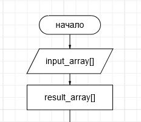
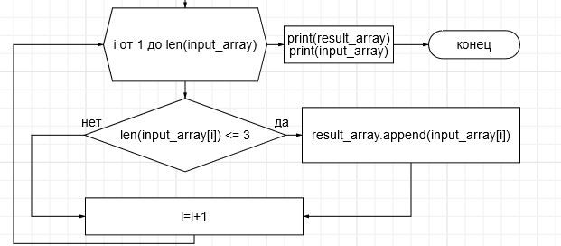

## README

1. Функция filter_short_strings принимает массив строк в качестве входных данных.

2. Внутри функции создается пустой массив result_array, *в который будут добавляться строки длиной меньше либо равной 3 символам

3. Программа проходит по всем строкам в цикле FOR в input_array и проверяет длину каждой строки.

4. Если длина строки меньше или равна 3, она добавляется в result_array.

5. Функция возвращает отфильтрованный массив result_array.

6. Вызывается функция filter_short_strings и результат выводится на экран.

